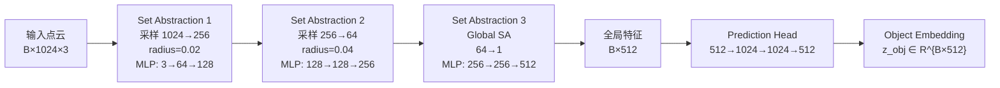
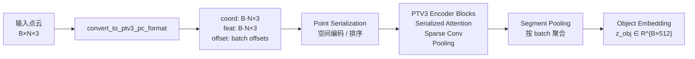
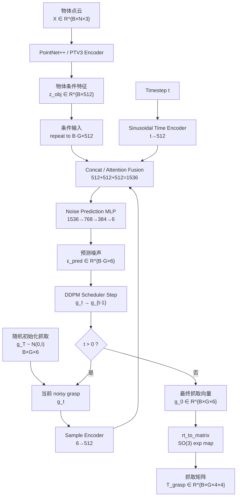
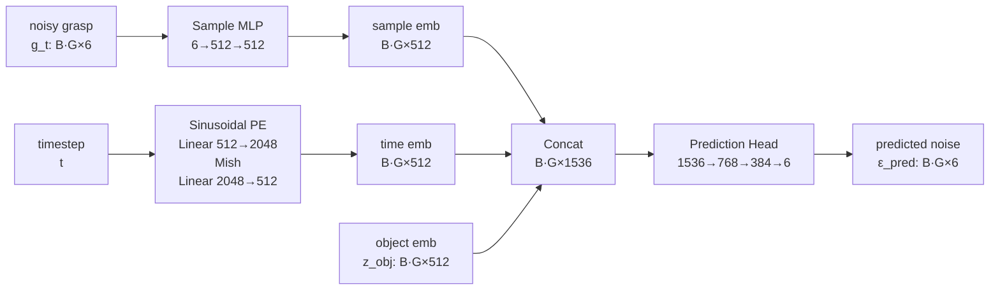
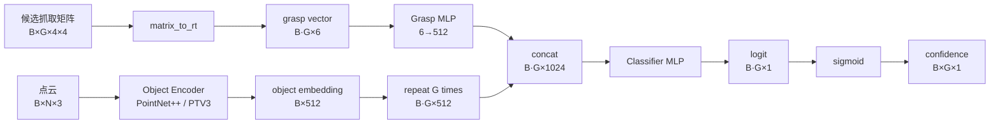
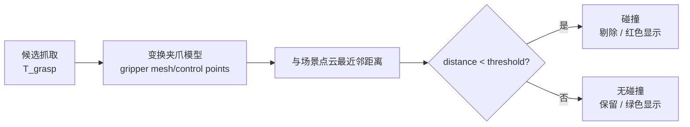
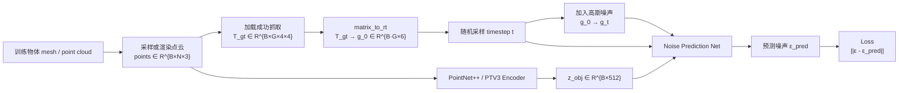
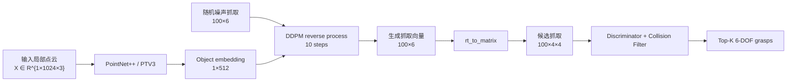
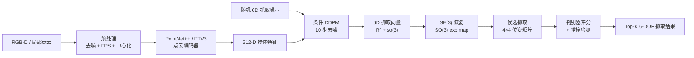

# GraspGen 数据流与神经网络架构说明

> 本文档面向课程作业“基于局部点云的 6 自由度抓取位姿估计”，结合 GraspGen 论文与本项目源码，说明：一个局部点云输入后，数据如何一步步经过预处理、点云编码器、扩散生成器、判别器和碰撞检测，最终输出 6-DOF 抓取位姿。
>
> 参考论文 OCR 文档：`docs/GraspGen.pdf_by_PaddleOCR-VL-1.5.md`  
> 参考源码：`GraspGen/grasp_gen/`

---

## 1. GraspGen 的任务定义

GraspGen 要解决的问题是：

> 给定一个物体的局部点云，生成一组空间上多样、物理上可执行的 6-DOF 抓取位姿。

输入是 object-centric point cloud：

```text
X = {p_i | p_i ∈ R^3, i = 1...N}
```

输出是一组抓取姿态：

```text
G = {T_1, T_2, ..., T_K}
```

每个抓取位姿是一个 SE(3) 齐次变换矩阵：

```text
T_grasp = [ R  t ]
          [ 0  1 ]

R ∈ SO(3), t ∈ R^3
```

其中：

- `R` 表示夹爪姿态；
- `t` 表示夹爪 TCP 或抓取坐标系的位置；
- 一个 `4×4` 矩阵完整描述一个 6 自由度抓取姿态。

论文中将该问题建模为条件生成问题：

```text
p(T_grasp | X)
```

即：在给定物体点云 `X` 的条件下，生成合理的抓取位姿分布。

---

## 2. 总体神经网络架构

GraspGen 的整体架构可以概括为：

```text
Point Cloud Encoder + Conditional DDPM Generator + Discriminator + Collision Filter
```

其中：

1. **Point Cloud Encoder**：把输入局部点云编码成物体几何特征；
2. **Conditional DDPM Generator**：在物体特征条件下，从随机噪声逐步去噪生成抓取位姿；
3. **Discriminator**：对生成的候选抓取进行成功概率评分；
4. **Collision Filter**：结合场景点云或夹爪模型做几何碰撞过滤；
5. **Top-K Selection**：输出最终可执行抓取。

---

## 3. 总体数据流图

```mermaid
flowchart LR
    A["原始输入<br/>RGB-D / mesh / scene crop"]
    --> B["局部点云<br/>X_raw ∈ R^{N×3}"]

    B --> C["点云预处理<br/>去无效深度 / mask 提取 / SOR 去噪 / FPS 采样"]
    C --> D["中心化与归一化<br/>X_c = X_raw - mean(X_raw)<br/>可选 κ 缩放"]

    D --> E["Point Cloud Encoder<br/>PointNet++ 或 PTV3"]
    E --> F["物体几何特征<br/>z_obj ∈ R^{512}"]

    F --> G["复制到每个候选抓取<br/>z_obj → R^{G×512}"]

    H["随机抓取噪声<br/>g_T ~ N(0,I)<br/>g_T ∈ R^{G×6}"]
    --> I["Conditional DDPM<br/>10-step reverse denoising"]

    G --> I
    I --> J["最终 6D 抓取向量<br/>g_0 = [t_x,t_y,t_z,r_x,r_y,r_z]"]

    J --> K["SO(3) exp map + translation<br/>rt_to_matrix"]
    K --> L["候选抓取矩阵<br/>T_grasp ∈ R^{G×4×4}"]

    L --> M["Discriminator<br/>抓取成功概率评分"]
    L --> N["Collision Filter<br/>夹爪-场景碰撞检测"]

    M --> O["排序 / 阈值过滤 / Top-K"]
    N --> O

    O --> P["最终输出<br/>K 个 6-DOF 抓取位姿"]
```



---

## 4. 从原始数据到点云输入

### 4.1 RGB-D 到点云

如果输入来自 RGB-D 相机，则首先根据相机内参把深度图投影成三维点云。

对像素点 `(u, v)`，深度为 `d`，相机内参为 `fx, fy, cx, cy`，则：

```text
X = (u - cx) · d / fx
Y = (v - cy) · d / fy
Z = d
```

得到原始场景点云：

```text
P_scene ∈ R^{M×3}
```

然后根据目标物体 mask 或局部裁剪得到 object-centric 点云：

```text
X_raw ∈ R^{N_raw×3}
```

### 4.2 点云预处理

为了让网络输入稳定，本项目和 GraspGen 推理流程都会对点云做预处理：

```text
原始深度 / 点云
  ↓
去除无效深度点
  ↓
目标 mask 或局部区域裁剪
  ↓
统计离群点去除 SOR
  ↓
FPS 或随机采样到固定点数
  ↓
得到 N 个点的局部物体点云
```

本项目中常用：

```text
N = 1024
```

因此网络输入可以写成：

```text
X_raw ∈ R^{1024×3}
```

---

## 5. 点云中心化与坐标变换

GraspGen 是 object-centric 方法。输入点云在进入神经网络前会被中心化：

```text
p_mean = mean(X_raw)
X_c = X_raw - p_mean
```

数据形状不变：

```text
X_raw ∈ R^{N×3}
X_c   ∈ R^{N×3}
```

这样做的目的：

1. 让网络不必学习绝对相机坐标，而只关注物体局部几何；
2. 抓取生成在物体中心坐标系下进行；
3. 最终输出时再把 `p_mean` 加回到抓取平移部分，恢复到原始相机 / 场景坐标系。

批处理后：

```text
points ∈ R^{B×N×3}
```

单物体推理时：

```text
B = 1
points ∈ R^{1×1024×3}
```

源码中该逻辑主要位于：

```text
GraspGen/grasp_gen/grasp_server.py
```

---

## 6. 点云编码器：PointNet++ 与 PTV3 的作用

点云编码器的作用是把无序点云变成一个固定长度的物体几何特征向量：

```text
points ∈ R^{B×N×3}
        ↓ encoder
z_obj  ∈ R^{B×512}
```

这个 `z_obj` 是后续扩散模型的条件信息。也就是说，扩散模型生成什么样的抓取，取决于这个 512 维物体形状 embedding。

GraspGen 支持多种 backbone：

| Backbone | 源码选项 | 作用 | 特点 |
|---|---|---|---|
| PointNet++ | `obs_backbone="pointnet"` | 层次化提取点云局部到全局特征 | 显存占用较低，适合本项目 RTX 3060 6GB 训练 |
| PointTransformerV3 | `obs_backbone="ptv3"` | 用 Transformer 方式编码点云 | 官方 pretrained 主要使用，表达能力更强 |
| ViT | `obs_backbone="vit"` | 图像/其他观测形式扩展 | 本项目不是重点 |

对应源码：

```text
GraspGen/grasp_gen/models/generator.py
```

关键逻辑：

```python
if obs_backbone == "pointnet":
    self.object_encoder = PointNetPlusPlus(...)
elif obs_backbone == "ptv3":
    self.object_encoder = PointTransformerV3(...)
```

---

## 7. PointNet++ 在 GraspGen 中的作用

### 7.1 PointNet++ 的功能

PointNet++ 负责从点云中逐级提取几何特征：

```text
局部边缘 / 表面结构
  ↓
中尺度形状结构
  ↓
全局物体形状 embedding
```

它不是直接输出抓取，而是输出物体形状特征：

```text
z_obj ∈ R^{512}
```

扩散模型再根据该特征生成抓取。

### 7.2 PointNet++ 数据流图



源码参数位于：

```text
GraspGen/grasp_gen/models/model_utils.py
```

核心配置：

```python
OBJ_NPOINTS  = [256, 64, None]
OBJ_RADII    = [0.02, 0.04, None]
OBJ_NSAMPLES = [64, 128, None]
OBJ_MLPS     = [[0,64,128], [128,128,256], [256,256,512]]
```

### 7.3 PointNet++ 逐层维度

PointNet++ 的核心是 Set Abstraction，内部包含三个关键动作：

```text
采样中心点 FPS -> 查询局部邻域 ball query -> 对邻域点做 PointNet/MLP 聚合
```

更具体地说，输入点云是一个无序集合：

```text
P = {p_i}, p_i = [x_i, y_i, z_i]
```

PointNet++ 不把点云当成规则网格，而是先选出一批中心点，再在每个中心点附近找邻域点。

#### 7.3.1 FPS：最远点采样

FPS 的作用是从 `N` 个点中选出分布尽可能均匀的中心点。

```text
输入:  B × N × 3
输出:  B × S × 3
```

其中 `S` 是采样后的中心点个数。例如第一层：

```text
N = 1024
S = 256
```

因此：

```text
B×1024×3 -> B×256×3
```

FPS 选择中心点后，每个中心点会代表一个局部区域。

#### 7.3.2 ball query：球邻域查询

对每个中心点，在半径 `r` 内查找最多 `K` 个邻居点。

```text
输入中心点:       B × S × 3
输入原始点:       B × N × 3
输出邻域点索引:   B × S × K
输出邻域点坐标:   B × S × K × 3
```

例如第一层配置：

```text
S = 256
K = 64
radius = 0.02
```

所以每个物体会形成：

```text
256 个局部 patch
每个 patch 最多 64 个邻域点
每个点有 3 个坐标
```

即：

```text
B × 256 × 64 × 3
```

#### 7.3.3 局部坐标归一化

对每个 patch，邻域点通常会减去中心点坐标：

```text
p_relative = p_neighbor - p_center
```

这样 MLP 学到的是局部几何形状，而不是绝对位置。

#### 7.3.4 PointNet/MLP 局部特征聚合

每个 patch 内的邻域点经过共享 MLP：

```text
B × S × K × C_in
  ↓ shared MLP
B × S × K × C_out
  ↓ max pooling over K neighbors
B × S × C_out
```

这里的 max pooling 是 PointNet 的对称聚合函数，它保证输入点顺序变化时，输出特征不变。

第一层可以理解为：

```text
B × 256 × 64 × 3
  ↓ MLP 3→64→128
B × 256 × 64 × 128
  ↓ max over 64 neighbors
B × 256 × 128
```

第二层继续在 `256` 个中心点上再采样到 `64` 个更稀疏中心点，并聚合更大局部区域。

因此 PointNet++ 的特征聚合机制本质是：

```text
点 -> 局部 patch 特征 -> 更大 patch 特征 -> 全局物体特征
```

以 `B=1, N=1024` 为例：

| 阶段 | 操作 | 输出维度 | 含义 |
|---|---|---|---|
| 输入 | 点云 | `1×1024×3` | 1024 个三维点 |
| SA1 | 局部邻域聚合 | `1×256×128` | 小尺度局部几何 |
| SA2 | 中尺度邻域聚合 | `1×64×256` | 物体局部结构 |
| SA3 | 全局聚合 | `1×1×512` | 整体物体特征 |
| squeeze | 去掉点维度 | `1×512` | 全局 embedding |
| MLP Head | 特征变换 | `1×512` | 最终 object token |

本项目使用 PointNet++ 的原因：

- 训练显存更低；
- 在 RTX 3060 Laptop 6GB 上更容易跑通；
- 适合作业中说明“轻量化适配训练”。

---

## 8. PTV3 在 GraspGen 中的作用

### 8.1 PTV3 的功能

PointTransformerV3 是论文中强调的更强点云编码器。它同样输出：

```text
z_obj ∈ R^{B×512}
```

但提取方式不同。

PointNet++ 主要依赖：

```text
FPS + ball query + 局部 MLP 聚合
```

PTV3 则通过：

```text
点云序列化 + Transformer attention + sparse convolution / pooling
```

来提取点云特征。

论文中提到，PTV3 通过 serialization 将无序点云转成更适合 Transformer 处理的结构，避免了传统点云网络中大量最近邻 / ball query 操作的瓶颈，并在实验中相较 PointNet++ 取得更低平移误差和更高 recall。

### 8.2 PTV3 数据流图



### 8.3 PTV3 的内部数据结构与特征聚合机制

PTV3 的输入不是传统的规则图像张量，而是稀疏点云结构。源码中会先把：

```text
points ∈ R^{B×N×3}
```

转换成适合 PTV3 处理的字典结构：

```text
coord  ∈ R^{B·N×3}
feat   ∈ R^{B·N×C}
offset ∈ R^{B}
```

其中：

| 字段 | 含义 | 例子 |
|---|---|---|
| `coord` | 所有 batch 中点的三维坐标被展平 | `B·N×3` |
| `feat` | 每个点的输入特征，GraspGen 中常用 xyz 本身作为特征 | `B·N×3` |
| `offset` | 每个 batch 样本的结束位置，用来区分不同物体 | `[N, 2N, 3N, ...]` |

例如：

```text
B = 2, N = 1024
coord.shape = 2048 × 3
feat.shape  = 2048 × 3
offset      = [1024, 2048]
```

`offset` 的作用类似于告诉网络：

```text
第 0~1023 个点属于第 1 个物体；
第 1024~2047 个点属于第 2 个物体。
```

PTV3 的特征聚合大致包含以下步骤：

```text
点云展平
  ↓
空间序列化 serialization
  ↓
按空间顺序组织 token
  ↓
Serialized Attention 在局部/层级 token 上交换信息
  ↓
Sparse Conv / Pooling 降采样并扩大感受野
  ↓
Segment Pooling 按 offset 聚合回每个物体
  ↓
输出 B×512 object embedding
```

可以理解为：

```text
PointNet++ 是“先找球形邻域，再局部 MLP 聚合”；
PTV3 是“先把点云按空间规则序列化，再用 Transformer attention 聚合”。
```

PTV3 中每个点更像一个 token：

```text
token_i = [coord_i, feat_i]
```

attention 会让不同空间位置的 token 交换信息，因此它更容易捕捉长距离几何关系，例如：

- 杯子的把手和杯身之间的关系；
- 物体两侧夹取区域之间的对称关系；
- 遮挡点云中局部可见区域与整体形状的关系。

最终通过按 batch 的 segment pooling，把所有点 token 聚合成一个物体级 token：

```text
{token_1, token_2, ..., token_N}
  ↓ segment pooling
z_obj ∈ R^{512}
```

因此 PTV3 在 GraspGen 中的作用仍然是输出 `512` 维 object embedding，只是它的聚合机制比 PointNet++ 更强。

### 8.4 PTV3 与 PointNet++ 的对比

| 对比项 | PointNet++ | PTV3 |
|---|---|---|
| 编码思想 | 层次化局部邻域聚合 | 序列化点云 + Transformer |
| 主要算子 | FPS、ball query、PointNet MLP | serialized attention、sparse conv |
| 输出 | `B×512` object embedding | `B×512` object embedding |
| 优点 | 轻量、稳定、显存较低 | 表达能力强、效果更好 |
| 缺点 | 对复杂几何表达能力弱于 Transformer | 显存和依赖要求更高 |
| 本项目用途 | 自训练模型使用 | 官方 pretrained 演示主线使用 |

无论使用 PointNet++ 还是 PTV3，它们在 GraspGen 中的角色是一样的：

> 把点云压缩成条件扩散模型可以使用的物体几何 token。

即：

```text
PointNet++ / PTV3 不直接生成抓取；
它们只负责告诉扩散模型“这个物体长什么样”。
```

---

## 9. 抓取姿态的内部 6D 表示

虽然最终输出是：

```text
T_grasp ∈ R^{4×4}
```

但扩散模型不能直接方便地在 `4×4` 矩阵上加高斯噪声。因此 GraspGen 将抓取矩阵转换成欧氏空间中的向量。

本项目使用：

```text
grasp_repr = r3_so3
```

即：

```text
g = [t_x, t_y, t_z, r_x, r_y, r_z] ∈ R^6
```

其中：

- 前 3 维：平移 `t ∈ R^3`；
- 后 3 维：旋转矩阵 `R ∈ SO(3)` 的李代数表示 `so(3)`。

这里需要解释 `SO(3)` 和 `so(3)` 的含义。

#### SO(3)：三维旋转矩阵空间

`SO(3)` 是所有合法三维旋转矩阵组成的空间：

```text
SO(3) = { R ∈ R^{3×3} | R^T R = I, det(R)=1 }
```

也就是说，合法旋转矩阵必须满足：

1. 列向量两两正交；
2. 每个列向量长度为 1；
3. 行列式为 1，表示没有镜像翻转。

问题是：

```text
SO(3) 不是普通欧氏空间。
```

这意味着不能简单地对旋转矩阵的 9 个元素直接加高斯噪声，否则很容易破坏旋转矩阵的正交性，得到非法旋转。

例如对 `R` 直接加噪：

```text
R_noisy = R + ε
```

通常会导致：

```text
R_noisy^T R_noisy ≠ I
```

所以它不再是合法旋转。

#### so(3)：SO(3) 的李代数空间

`so(3)` 可以理解为 `SO(3)` 在单位旋转附近的局部线性空间。它可以用一个三维旋转向量表示：

```text
r = [r_x, r_y, r_z] ∈ R^3
```

这个向量的方向表示旋转轴，模长表示旋转角度。

```text
方向:  rotation axis
长度:  rotation angle
```

因此，`so(3)` 的好处是：

```text
它是 3 维欧氏向量空间，可以方便地加噪、预测噪声和做神经网络回归。
```

GraspGen 的处理方式是：

```text
旋转矩阵 R ∈ SO(3)
  ↓ log map
旋转向量 r ∈ so(3) ≈ R^3
  ↓ 扩散模型加噪 / 去噪
预测后的旋转向量 r_hat
  ↓ exp map
旋转矩阵 R_hat ∈ SO(3)
```

其中：

- `log_SO3`：把旋转矩阵映射到三维旋转向量；
- `exp_SO3`：把三维旋转向量恢复成合法旋转矩阵。

这样既能让扩散模型在欧氏空间中工作，又能保证最终恢复出的旋转是合法的。

### 9.1 矩阵转 6D 向量

```text
T = [R, t]

r = log_SO3(R) / π
g = concat(κ · t, r)
```

其中 `κ` 是平移归一化系数。论文中 Franka Panda 使用：

```text
κ = 3.27
```

本项目训练也使用：

```text
diffusion.kappa = 3.27
```

源码：

```text
GraspGen/grasp_gen/utils/math_utils.py
```

对应函数：

```python
matrix_to_rt()
```

### 9.2 6D 向量转 4×4 矩阵

扩散模型生成最终向量：

```text
g_0 = [t_x, t_y, t_z, r_x, r_y, r_z]
```

恢复为矩阵：

```text
R = exp_SO3([r_x,r_y,r_z] · π)
t = [t_x,t_y,t_z] / κ

T = [R, t]
    [0, 1]
```

源码函数：

```python
rt_to_matrix()
```

---

## 10. 扩散模型在 GraspGen 中如何作用

### 10.1 为什么要用扩散模型

一个物体通常有很多可行抓取，例如：

- 从左侧夹取；
- 从右侧夹取；
- 从上方夹取；
- 抓把手；
- 抓边缘；
- 抓凸起处。

因此抓取分布是多峰的：

```text
p(T_grasp | X) 是 multi-modal distribution
```

传统回归模型容易只预测一个平均姿态，而平均姿态可能不是有效抓取。扩散模型适合建模这种多模态连续分布。

### 10.2 训练阶段：学习如何去噪

训练时有真实成功抓取：

```text
g_0 = ground-truth grasp vector
```

随机采样扩散时间步：

```text
t ∈ [0, T]
```

加入高斯噪声：

```text
g_t = sqrt(α_t) g_0 + sqrt(1 - α_t) ε
```

网络输入：

```text
当前带噪抓取 g_t
时间步 t
物体点云特征 z_obj
```

网络输出：

```text
ε_pred = φ(g_t, t, z_obj)
```

训练目标：

```text
L = || ε - ε_pred ||
```

论文中表达为：

```text
L = || ε - φ(t, g_t, X) ||²
```

也就是说，扩散模型不是直接学习“输出抓取”，而是学习：

> 在某个噪声等级下，如何根据物体点云判断当前抓取向量里的噪声是多少。

### 10.3 推理阶段：从随机噪声逐步变成抓取

推理时没有真实抓取，直接从随机噪声开始：

```text
g_T ~ N(0, I)
```

然后反复去噪：

```text
g_T → g_{T-1} → g_{T-2} → ... → g_1 → g_0
```

在每一步：

```text
ε_pred = φ(g_t, t, z_obj)
g_{t-1} = DDPM_Scheduler(g_t, ε_pred, t)
```

论文和源码中通常使用：

```text
T = 10
```

本项目训练配置：

```text
diffusion.num_diffusion_iters = 10
diffusion.num_diffusion_iters_eval = 10
```

### 10.4 扩散模型作用图



---

## 11. DiffusionNoisePredictionNet 具体结构

源码中的扩散噪声预测网络是：

```text
DiffusionNoisePredictionNet
```

位置：

```text
GraspGen/grasp_gen/models/generator.py
```

它有三类输入：

| 输入 | 维度 | 含义 |
|---|---|---|
| noisy grasp sample | `B·G×6` | 当前带噪抓取向量 |
| timestep | `B·G` | 当前扩散步 |
| object embedding | `B·G×512` | 点云编码器输出的物体特征 |

这里的 `B·G` 非常重要，不能简单理解成一个新的神经网络层，而是 **batch 维度被展开后的样本总数**。

- `B` 表示一个 mini-batch 中有多少个物体点云；
- `G` 表示每个物体同时生成多少个候选抓取；
- `B·G` 表示把“每个物体的每个候选抓取”都看成一个独立 diffusion sample 后的总数量。

例如：

```text
B = 64    # 一次训练读入 64 个物体点云
G = 100   # 每个物体采样 100 个抓取

B·G = 64 × 100 = 6400
```

于是：

```text
points:             B × N × 3      = 64 × 1024 × 3
object embedding:   B × 512        = 64 × 512
candidate grasps:   B × G × 6      = 64 × 100 × 6
展开后 grasps:      B·G × 6        = 6400 × 6
展开后 object emb:  B·G × 512      = 6400 × 512
```

这样处理的原因是：

> 同一个物体点云对应多个候选抓取。点云编码器只需要对每个物体算一次 `512` 维特征，然后把这个特征复制 `G` 份，让每一个候选抓取都能以该物体特征作为条件进行去噪。

也就是说，扩散网络实际看到的是：

```text
第 1 个物体的第 1 个抓取样本
第 1 个物体的第 2 个抓取样本
...
第 B 个物体的第 G 个抓取样本
```

这些样本被展平成：

```text
B·G 个 diffusion samples
```

### 11.1 noisy grasp sample encoder

```text
g_t ∈ R^{B·G×6}
  ↓ Linear 6→512
  ↓ ReLU
  ↓ Linear 512→512
sample_embedding ∈ R^{B·G×512}
```

### 11.2 timestep encoder

```text
t
  ↓ SinusoidalPosEmb(512)
  ↓ Linear 512→2048
  ↓ Mish
  ↓ Linear 2048→512
time_embedding ∈ R^{B·G×512}
```

### 11.3 object embedding

```text
z_obj ∈ R^{B×512}
  ↓ repeat G times
z_obj_repeat ∈ R^{B·G×512}
```

### 11.4 embedding 融合与噪声预测

本项目中使用：

```text
diffusion.attention = "cat"
```

即直接拼接：

```text
h = concat(sample_embedding, time_embedding, object_embedding)
```

维度：

```text
512 + 512 + 512 = 1536
```

这里的 `512×3` 或 `512 + 512 + 512` 表示三个不同来源的特征被拼接在一起，而不是图像里的三通道。它们分别是：

| 512 维特征 | 来源 | 表达的信息 | 对扩散模型的作用 |
|---|---|---|---|
| `sample_embedding ∈ R^{512}` | 当前 noisy grasp `g_t` 经过 MLP 编码 | 当前候选抓取“现在在哪里、姿态是什么、噪声状态如何” | 告诉网络当前要去噪的对象是什么 |
| `time_embedding ∈ R^{512}` | diffusion timestep `t` 经过 SinusoidalPosEmb + MLP 编码 | 当前是第几步去噪，噪声强度大概是多少 | 告诉网络应该去掉多少噪声 |
| `object_embedding ∈ R^{512}` | PointNet++ / PTV3 编码点云得到 | 物体形状、尺度、局部几何、可抓区域 | 告诉网络什么样的抓取对这个物体合理 |

拼接后：

```text
h = [sample_embedding, time_embedding, object_embedding]
  ∈ R^{B·G×1536}
```

换句话说，每一个候选抓取在每一个 diffusion step 中，网络都会同时回答三个问题：

```text
1. 当前抓取长什么样？          -> sample embedding
2. 当前处于第几步去噪？        -> time embedding
3. 当前物体的几何形状是什么？  -> object embedding
```

然后输入 prediction head：

```text
h ∈ R^{B·G×1536}
  ↓ Linear 1536→768
  ↓ ReLU
  ↓ Linear 768→384
  ↓ ReLU
  ↓ Linear 384→6
ε_pred ∈ R^{B·G×6}
```

结构图：



---

## 12. 平移和旋转的分离调度

GraspGen 论文中指出，将平移和旋转分别使用独立 denoising scheduler 效果更好。

抓取向量：

```text
g = [t_x, t_y, t_z, r_x, r_y, r_z]
```

可以拆成：

```text
g_pos = [t_x, t_y, t_z]
g_rot = [r_x, r_y, r_z]
```

源码中对应：

```text
noise_scheduler_pos
noise_scheduler_rot
```

即：

```text
translation scheduler: g_pos_t → g_pos_{t-1}
rotation scheduler:    g_rot_t → g_rot_{t-1}
```

原因：

- 平移属于 `R^3`，尺度与物体大小有关；
- 旋转属于 `SO(3)` 的李代数空间，范围和几何性质不同；
- 分开建模可以让扩散过程更稳定。

---

## 13. 判别器如何筛选抓取

扩散生成器会产生多个候选抓取，但其中可能存在：

- 离物体太远的抓取；
- 与物体或场景碰撞的抓取；
- 姿态合理但执行成功率低的抓取；
- 由于生成误差产生的 false positive。

因此 GraspGen 还使用 discriminator 进行抓取质量评分。

### 13.1 判别器输入输出

输入：

```text
点云 X
候选抓取 T_grasp
```

输出：

```text
confidence ∈ [0, 1]
```

表示该抓取成功的概率。

### 13.2 判别器结构图



论文中强调 discriminator 的训练使用 **On-Generator Training**：

1. 先训练 generator；
2. 用 generator 在训练物体上生成大量候选抓取；
3. 对这些候选抓取重新仿真标注成功/失败；
4. 用这些来自 generator 自身分布的数据训练 discriminator。

这样判别器更懂 generator 容易犯的错误。

---

## 14. 碰撞检测与最终输出

神经网络输出候选抓取后，还需要做几何碰撞检测。

基本思路：

```text
候选抓取 T_grasp
  ↓
把夹爪 collision mesh / control points 变换到场景中
  ↓
计算夹爪点与场景点云的最近距离
  ↓
若距离小于阈值，则认为碰撞
  ↓
保留 collision-free grasp
```

流程图：



最终输出：

```text
Top-K collision-free grasps
```

每个抓取包含：

```text
score, T_grasp
```

其中：

```text
T_grasp =
[ r11 r12 r13 tx ]
[ r21 r22 r23 ty ]
[ r31 r32 r33 tz ]
[  0   0   0  1 ]
```

---

## 15. 完整逐层数据维度表

以单个物体、1024 点、生成 100 个候选抓取为例：

```text
B = 1
N = 1024
G = 100
D = 6
```

| 阶段 | 操作 | 数据形状 | 说明 |
|---|---|---|---|
| 1 | 原始 RGB-D / mesh / 场景裁剪 | - | 原始观测数据 |
| 2 | 点云重建 / 采样 | `N_raw×3` | 得到物体局部点云 |
| 3 | 去噪、FPS | `1024×3` | 固定点数输入 |
| 4 | 中心化 | `1024×3` | 减去点云均值 |
| 5 | batch 化 | `1×1024×3` | 神经网络输入 |
| 6 | PointNet++ / PTV3 | `1×512` | 物体几何 embedding |
| 7 | 复制到每个候选抓取 | `100×512` | 每个抓取共享物体条件 |
| 8 | 初始化随机抓取噪声 | `100×6` | DDPM 初始噪声 |
| 9 | timestep embedding | `100×512` | 当前扩散步编码 |
| 10 | sample embedding | `100×512` | noisy grasp 编码 |
| 11 | 拼接融合 | `100×1536` | 条件扩散输入 |
| 12 | 噪声预测 MLP | `100×6` | 预测噪声 |
| 13 | DDPM step | `100×6` | `g_t → g_{t-1}` |
| 14 | 重复 10 步 | `100×6` | 得到最终抓取向量 |
| 15 | `rt_to_matrix` | `100×4×4` | 恢复 6-DOF 齐次矩阵 |
| 16 | 加回点云中心 | `100×4×4` | 回到相机/场景坐标系 |
| 17 | Discriminator | `100×1` | 成功概率评分 |
| 18 | Collision Filter | `100×1` | 是否碰撞 |
| 19 | Top-K | `K×4×4` | 最终抓取结果 |

---

## 16. 训练阶段的数据流

训练阶段和推理阶段的区别是：训练阶段有 ground-truth 成功抓取。



训练目标是让网络学会：

```text
在物体点云条件下，从任意噪声等级的抓取向量中预测噪声。
```

这样推理时就能从纯噪声逐步生成抓取。

---

## 17. 推理阶段的数据流

推理阶段没有 ground truth，只有输入点云。



---

## 18. 用一句话说明每个模块的作用

| 模块 | 一句话作用 |
|---|---|
| 点云预处理 | 把原始 RGB-D / mesh / 场景裁剪变成固定点数、干净、中心化的局部点云 |
| PointNet++ | 轻量级层次化点云编码器，把点云变成 512 维物体特征 |
| PTV3 | 更强的 Transformer 点云编码器，用点云序列化和 attention 提取更丰富几何特征 |
| DDPM Generator | 在物体特征条件下，从随机噪声逐步去噪生成 6D 抓取向量 |
| `r3_so3` 表示 | 把 4×4 抓取矩阵转成适合扩散加噪的 6D 欧氏向量 |
| `rt_to_matrix` | 把生成的 6D 向量恢复为 SE(3) 4×4 抓取位姿矩阵 |
| Discriminator | 判断每个候选抓取的成功概率，用于排序和过滤 |
| Collision Filter | 用几何方法剔除与物体/场景碰撞的抓取 |

---

## 19. 最终可放 PPT 的简洁版数据流



---

## 20. 总结

GraspGen 的核心不是直接从点云回归一个抓取，而是学习一个条件抓取分布：

```text
p(T_grasp | point cloud)
```

数据从原始输入到最终结果的过程可以总结为：

```text
原始 RGB-D / mesh / 场景点云
  ↓
局部物体点云提取
  ↓
去噪、采样、中心化
  ↓
PointNet++ / PTV3 编码为 512 维物体特征
  ↓
条件 DDPM 从随机 6D 噪声逐步去噪
  ↓
生成 [translation, so(3)] 抓取向量
  ↓
SO(3) exp map 恢复 4×4 SE(3) 位姿矩阵
  ↓
Discriminator 评分
  ↓
Collision Filter 剔除碰撞
  ↓
输出 Top-K 个 6-DOF 抓取姿态
```

其中：

- **PointNet++ / PTV3** 负责理解物体几何；
- **扩散模型** 负责从多模态抓取分布中采样候选位姿；
- **Discriminator** 负责判断候选抓取是否可靠；
- **碰撞检测** 负责保证候选抓取在当前场景中几何可执行。

因此，GraspGen 是一个完整的：

```text
局部点云 → 几何特征 → 扩散生成 → 抓取评分 → 碰撞过滤 → 6-DOF 抓取输出
```

的端到端 6 自由度抓取位姿估计框架。
