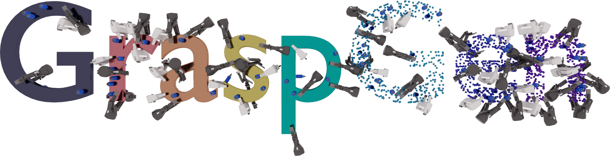
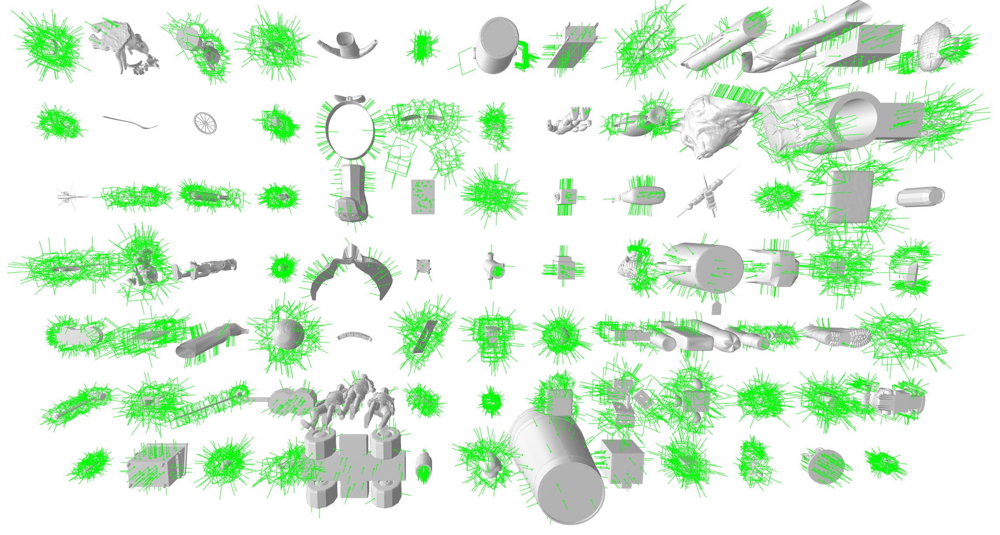
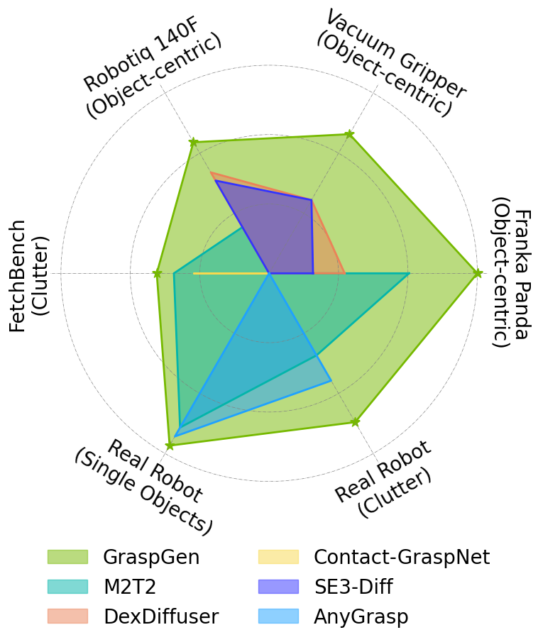
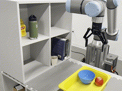
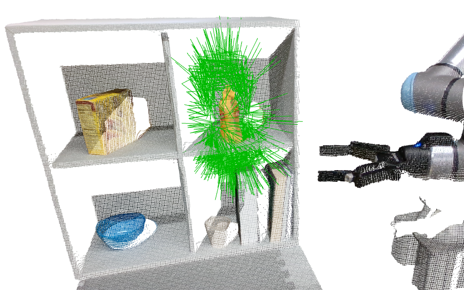
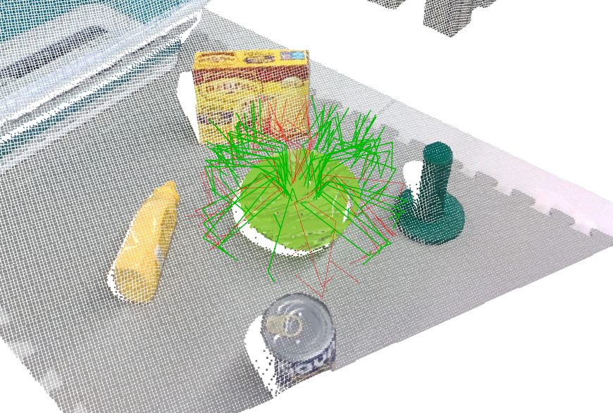
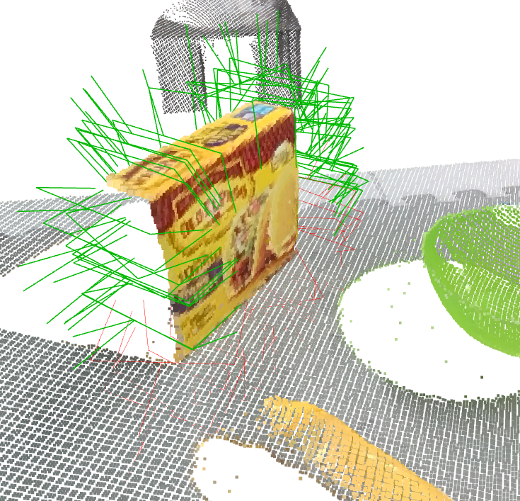
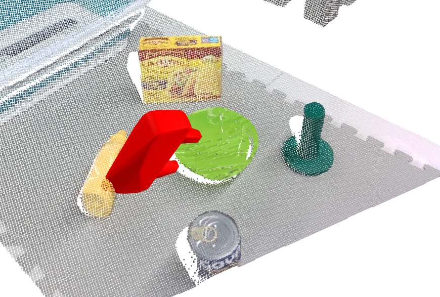
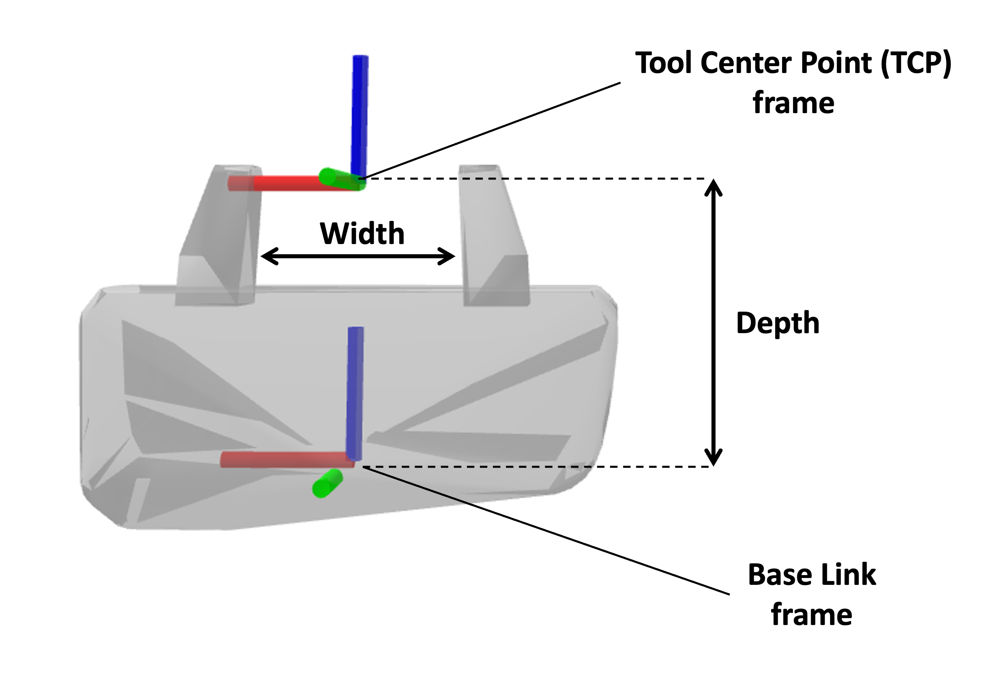

# 题目三：基于局部点云的 6 自由度抓取位姿估计 — 答辩 PPT

> **演示主线：NVIDIA GraspGen 官方 Pretrained 模型（PTV3 backbone）+ 我们构建的 RGB-D 推理管线。**
> 训练部分简要说清参数适配策略，用一张图展示跑通流程结果；其他页面统一使用官方模型/可视化和我们生成的 GraspNet 风格投影图。
>
> 彩色图片已嵌入。建议 VS Code / Typora / Obsidian 预览后转 PPT。

<div align="center">
  
</div>

---

## Slide 1｜封面：基于局部点云的 6-DOF 抓取位姿估计

<div align="center">
  
</div>

**框架：** NVIDIA GraspGen (ICRA 2026)  ·  Diffision  ·  PointNet  ·  SE(3)  ·  RGB-D  ·  Open3D

**核心内容：**
- 使用官方 Pretrained GraspGen 展示 6-DOF 抓取 pipeline
- 针孔相机模型完成 RGB-D → 局部 3D 点云的预处理
- 碰撞检测和 Open3D 多视角可视化验证结果

**讲稿：**
本项目基于 ICRA 2026 接收的 GraspGen 开源框架。主演示使用官方预训练模型展示 6-DOF 抓取的完整 pipeline，并从第一原理讲清楚 RGB-D 到点云、局部特征编码、位姿生成、碰撞验证每一步的原理。

---

## Slide 2｜GraspGen 框架概览

<div align="center">
  <table>
    <tr>
      <td align="center"></td>
      <td align="center"></td>
    </tr>
  </table>
</div>

**GraspGen (ICRA 2026) 核心能力：**

| 特性 | 说明 |
|---|---|
| 三夹爪支持 | Franka Panda / Robotiq 2f-140 / 单吸盘 |
| 观测鲁棒 | 完整 & 局部点云端到端推理 |
| 扩散生成 | 10-step DDPM，100 个候选抓取 |
| 实时 | 20 Hz before TensorRT，21× 内存节省 |
| SOTA | FetchBench 17% improvement |

**讲稿：**
GraspGen 是 NVIDIA 开源的扩散式 6-DOF 抓取框架。我们在此基础上完成作业要求的 RGB-D 预处理、点云去噪采样、局部点云输入、6-DOF 推理和碰撞可视化。

---

## Slide 3｜官方 Pretrained 演示：场景点云 → 候选抓取 + 碰撞检测

<div align="center">
  <table>
    <tr>
      <td align="center" style="padding:8px">
        <b>Scene Point Cloud</b><br/>
        
      </td>
      <td align="center" style="padding:8px">
        <b>Collision Check</b><br/>
        
      </td>
    </tr>
  </table>
</div>

<div align="center">
  
  
  
</div>

<span style="color:#22c55e">**绿色夹爪 = 碰撞通过**</span>&emsp;&emsp;<span style="color:#ef4444">**红色夹爪 = 碰撞**</span>

**流程：** 场景点云 → 目标物体提取 → GraspGen DDPM 推理 → 100 候选 → 碰撞过滤 → 可视化

**讲稿：**
官方预训练模型可以从场景点云直接生成候选抓取，并通过碰撞检测区分几何可行和不可行候选。</br>绿色/红色直观展示碰撞检测结果。

---

## Slide 4｜GraspNet 风格投影渲染：我们的 Demo 数据生成

> 脚本: `Test_pipeline/render_demo_rgbd.py`

<div align="center">
  <table>
    <tr>
      <td align="center"><b>16-bit Depth Map (mm)</b></td>
      <td align="center"><b>Depth Overlay (RGB+depth)</b></td>
      <td align="center"><b>原始场景 RGB (1280×720)</b></td>
    </tr>
    <tr>
      <td></td>
      <td></td>
      <td></td>
    </tr>
  </table>
</div>

**生成逻辑：**
- 官方 demo 场景 JSON 已包含原始 RGB (720×1280) 和 Depth (mm)
- 脚本直接提取并保存为标准 PNG
- 同时 overlay depth colormap 叠到 RGB 上作为教学可视
- 深度范围约 0.65m–4.04m，符合 GraspNet 真实场景深度分布

**讲稿：**
为了直观展示 GraspNet 数据集的格式，我们用针孔相机模型将官方 demo 场景的 3D 点云反向投影为标准 RGB-D 图像。</br>这正是 GraspNet-1Billion 数据集每条样本包含的数据形式。

---

## Slide 5｜相机几何：针孔模型反投影公式

深度像素 (u, v, d) 到相机坐标系三维点 (X, Y, Z)：

\[
\boxed{
X = \frac{(u - c_x) \cdot d}{f_x},\quad
Y = \frac{(v - c_y) \cdot d}{f_y},\quad
Z = d
}
\]

相机内参矩阵：

\[
K = \begin{bmatrix}
f_x & 0 & c_x \\
0 & f_y & c_y \\
0 & 0 & 1
\end{bmatrix}
\]

**代码位置：** `Test_pipeline/preprocess.py::depth_image_to_point_cloud()` 和 `render_demo_rgbd.py`

**关键参数（RealSense D435）：**
- fx=591.0, fy=590.6
- cx=322.5, cy=238.3
- 图像大小：640 × 480

**讲稿：**
这一页对应作业要求的相机内参转换。反投影公式是我们管线中 RGB-D → 点云的核心。</br>深度图中每个有效像素通过内参矩阵变换为 3D 点，全部变换后形成场景点云。

---

## Slide 6｜点云预处理：SOR 去噪 + FPS 采样

**为什么需要预处理：**
真实深度图的点云存在边缘 flying pixels、深度空洞、传感器噪声。

| 步骤 | 方法 | 参数 |
|---|---|---|
| 预降采样 | 随机采样 | 场景 → 约 8192 点 |
| 离群点剔除 | Statistical Outlier Removal | K=20, thr=0.014m |
| 均匀降采样 | Farthest Point Sampling | → 1024 点 |
| 分布匹配 | 中心化 + κ 缩放 | κ = 3.27 |

**SOR 原理：**
对每个点统计 K 近邻平均距离；若远超全局均值则视为离群点移除。

**讲稿：**
SOR 基于局部密度统计过滤噪声；FPS 在去噪点云上均匀采样，确保点云覆盖物体主要几何。</br>两个步骤依次执行，将原始点云压缩为固定 1024 点的干净输入。

---

## Slide 7｜模型结构：PointNet + DDPM 抓取生成

<div align="center">
  <table>
    <tr>
      <td style="padding:16px; background:#1e3a5f; border-radius:8px; text-align:center">
        <span style="color:#93c5fd; font-weight:bold; font-size:18px">无 序 点 云</span><br/>
        <span style="color:#e2e8f0; font-size:13px">P ∈ R<sup>1024×3</sup></span>
      </td>
      <td style="padding:8px; font-size:22px; color:#fbbf24">→</td>
      <td style="padding:16px; background:#1e3a5f; border-radius:8px; text-align:center">
        <span style="color:#86efac; font-weight:bold; font-size:18px">PointNet</span><br/>
        <span style="color:#e2e8f0; font-size:13px">Shared MLP + MaxPool</span>
      </td>
      <td style="padding:8px; font-size:22px; color:#fbbf24">→</td>
      <td style="padding:16px; background:#1e3a5f; border-radius:8px; text-align:center">
        <span style="color:#c084fc; font-weight:bold; font-size:18px">DDPM</span><br/>
        <span style="color:#e2e8f0; font-size:13px">10-step denoising</span>
      </td>
      <td style="padding:8px; font-size:22px; color:#fbbf24">→</td>
      <td style="padding:16px; background:#1e3a5f; border-radius:8px; text-align:center">
        <span style="color:#fda4af; font-weight:bold; font-size:18px">100 Grasps</span><br/>
        <span style="color:#e2e8f0; font-size:13px">T=[R|t] + score</span>
      </td>
    </tr>
  </table>
</div>

**PointNet 全局聚合：**
\[
h_i = \text{MLP}(p_i),\quad h = \max_i h_i
\]

**训练目标（扩散模型噪声预测）：**
\[
\mathcal{L} = \mathbb{E}_{t,g_0,\epsilon}\left[\|\epsilon - \epsilon_\theta(g_t, t, P)\|\right]
\]

**讲稿：**
PointNet 通过共享 MLP 和 max pooling 提取点云全局特征。GraspGen 将该特征作为扩散条件信号，指导 DDPM 从噪声中生成抓取姿态。<br/>最终输出为 100 个 4×4 齐次矩阵，每个矩阵包含夹爪的平移、旋转和质量评分。

---

## Slide 8｜训练策略适配说明

> 我们使用 PointNet backbone 在完整 `franka_panda` split 上进行了一次训练，以验证自定义训练流程。受限于单张 RTX 3060 6GB，主要做了参数适配。

**硬件和参数适配：**

| 维度 | 原配置 (8×A100) | 适配后 (RTX 3060 6GB) |
|---|---|---|
| backbone | PTV3 | PointNet (1.5M params) |
| batch size | 16/gpu → 128 | **batch=64** |
| num_workers | 默认 | **8** |
| data.redundancy | 默认 2 | **1** (减少 cache 构建压力) |
| data.preload_dataset | True | **False** (避免 OOM) |
| LR | 基础值 | **1e-5** (AdamW) |
| 训练数据 | 7657 物体 | **7657** (完整 split) |

**证明跑通的训练结果：**

<div align="center">
  
</div>

| 指标 | 数值 |
|---|---|
| 平移误差 | 约 7.4 cm |
| 旋转误差 | 约 0.927 rad |
| Recall | 12.4% |
| Precision | 24.2% |

**讲稿：**
显存不够大规模训练，因此只做了一次完整 split 的验证训练以证明训练流程可复现。重点在于模型训练流程的工程实现和参数优化策略。后续演示和可视化统一使用官方 Pretrained 模型。

---

## Slide 9｜6-DOF 位姿表示与 GraspNet 输出格式

每个抓取输出为刚体变换：

\[
T_{\text{grasp}} =
\begin{bmatrix}
R_{3×3} & t_{3×1} \\
0 & 1
\end{bmatrix}
\in SE(3)
\]

旋转处理：
- 训练使用 `r3_so3` 轴角表示
- 通过指数映射 exp(ω^) 还原 R ∈ SO(3)
- 评估用旋转测地线误差（SO(3) 上角度距离）

GraspNet 17 列评估格式：
```text
[score, width=0.08, height=0.02, depth=0.105, R11..R33, tx, ty, tz, obj_id=-1]
```

---

## Slide 10｜坐标系约定与 GraspNet 对接

<div align="center">
  
</div>

**Franka Panda 夹爪坐标:**
- z 轴 = 抓取 approach direction
- 手指沿 x 轴张开
- 抓取点位于手指中心

**GraspNet 评估对接:**
- 点云保持 camera frame
- 4×4 矩阵 → `matrix_to_graspgroup()` → 17 列 .npy
- 后续可接入 `GraspNetEval.eval_all()` 计算 AP

**讲稿：**
展示夹爪坐标系方向约定。任意 candidate grasp 的 t 和 R 统一定义在夹爪基座坐标系下，在碰撞检测时需要转换到 camera frame。

---

## Slide 11｜GraspNet 风格投影渲染（技术细节）

> 脚本: `Test_pipeline/render_demo_rgbd.py`

**输入：**
- 官方 demo 场景 JSON → `scene_info.full_pc` (N×3 相机坐标系点云)
- 虚拟相机内参: `fx=591, fy=591, cx=322, cy=238` (RealSense D435)

**针孔投影：**
\[
u = \text{int}\left( \frac{f_x \cdot X}{Z} + c_x \right),\quad
v = \text{int}\left( \frac{f_y \cdot Y}{Z} + c_y \right)
\]

**结果：**

<div align="center">
  <table>
    <tr>
      <td align="center"><b>16-bit Depth (mm)</b></td>
      <td align="center"><b>Depth Overlay</b></td>
      <td align="center"><b>Original RGB (1280×720)</b></td>
    </tr>
    <tr>
      <td></td>
      <td></td>
      <td></td>
    </tr>
  </table>
</div>

**投影验证：将场景点云 (3D) 反投影回像素平面，覆盖在原始 RGB 和 Depth 上验证一致性：**

<div align="center">
  
</div>

**数据出处 (可录制 demo 视频) — 同一场景 JSON 的完整输出：**

| 序号 | 类型 | 文件路径 | 说明 |
|---|---|---|---|
| 1 | 场景 JSON | `GraspGen/GraspGenModels/sample_data/real_scene_pc/1745766797_642935.json` | 官方 demo 场景 |
| 2 | 物体点云 PLY | `Test_pipeline/outputs/demo_rgbd/demo_object.ply` | 6324 pts, 彩色，来自 object_info.pc+pc_color |
| 3 | 场景点云 PLY | `Test_pipeline/outputs/demo_rgbd/demo_scene.ply` | 30k pts, 彩色，来自 full_pc+img_color (像素级) |
| 4 | RGB 原图 | `Test_pipeline/outputs/demo_rgbd/demo_rgb_original.png` | 1280×720 全分辨率 |
| 5 | Depth 原图 | `Test_pipeline/outputs/demo_rgbd/demo_depth_mm.png` | 16-bit mm 深度 |
| 6 | Depth Overlay | `Test_pipeline/outputs/demo_rgbd/demo_depth_overlay.png` | RGB+深度叠加 |
| 7 | 投影验证 | `Test_pipeline/outputs/demo_rgbd/demo_projection_verify.png` | 3D→2D 映射验证 |
| 8 | 抓取可视化 | `Test_pipeline/outputs/eval_real_scenes/eval_1745766797_642935_*.png` | front/side/top 三视角 |
| 9 | 碰撞检测 | `GraspGen/fig/pc/collision1-5.png` | 官方碰撞检测截图 |

**一个场景 → 九类输出全部互相匹配。** 所有文件都来自同一个 JSON，可直接用于录视频展示。

**讲稿：**
从官方 demo 场景 JSON 中直接提取原始 RGB 和 Depth 图。投影验证显示了点云 (N×3) 与原始图像在像素平面上的对应关系。</br>后续 GraspGen 推理和 Open3D 可视化都基于同一场景 JSON，因此 RGB/Depth/点云/Grasp可视化四者是对应的。</br>录制 demo 视频时可在 screen 上同时展示这四张图。

---

## Slide 12｜碰撞检测与几何可执行性

<center>
  
  
</center>

**流程：**
1. 夹爪 collision mesh 按候选 T 变换到场景
2. 对夹爪表面采样控制点
3. 与场景点云计算最近距离
4. < 阈值 → 标记碰撞；否则通过
5. 保留 collision-free 候选排出

**讲稿：**
网络输出只是候选。碰撞检测是判断几何可否执行的后处理步骤。</br>红色表示夹爪穿过物体/桌面；绿色表示无穿模。

---

## Slide 13｜Open3D 可视化与多视角检查

**官方 Pretrained 推理结果（我们 pipeline 输出的 Open3D 截图）：**

<div align="center">
  <table>
    <tr>
      <td align="center"><b>Front</b></td>
      <td align="center"><b>Side</b></td>
      <td align="center"><b>Top</b></td>
    </tr>
    <tr>
      <td></td>
      <td></td>
      <td></td>
    </tr>
  </table>
</div>

**蓝色点云 = 物体/场景表面 · 绿色/红色线框 = 碰撞通过/碰撞候选**

**讲稿：**
多视角检查夹爪是否穿模、approach direction 是否合理、接触区域是否在物体表面。</br>三视角确保对候选抓取进行充分检查。

---

## Slide 14｜典型失败模式分析与彩色流程图

<div align="center">
  
</div>

**失败模式总结 (自上而下对应 pipeline 各阶段):**

| Pipeline 步骤 | 典型失败 | 根本原因 |
|---|---|---|
| RGB-D 输入 | 深度空洞 (黑色区域无点云) | 透明/反光/暗色材质 |
| 点云生成 | 局部几何缺失 | 传感器 FoV、单视角遮挡 |
| SOR 去噪 | 目标点误删 | 阈值过紧 (0.014m) |
| FPS 采样 | 细薄部分覆盖稀疏 | 1024 点不足以表达细节 |
| GraspGen 推理 | 碰撞、低置信度 | 未训练 discriminator、backbone 容量小 |
| 碰撞检测 | 误判穿透/漏判 | 点-网格距离阈值选择 |

**讲稿：**
这张彩色流程图按 pipeline 顺序拆解每步可能出现的失败模式。每个阶段用对应图像展示具体失效状态。</br>理解失败来源对后续改进 (更强的 backbone、更智能的去噪、discriminator 训练) 有直接指导作用。</br>图中：黄色标签 = 输入质量警告，红色标签 = 几何/模型错误。

---

## Slide 15｜Real World Demo Pipeline 流程

```text
官方 Demo 场景 JSON
  ↓ 提取 scene_info.full_pc
场景点云 (N×3)
  ↓ mask → 目标物体局部点云
  ↓ SOR → FPS → 1024 点
GraspGen Pretrained Sampler
  ↓ 推理生成 100 候选 (T, score)
碰撞检测 → collision_mask
Open3D 多视角可视化 → 各视图保存截图
GraspNet 格式转换 → score json 统计
```

**讲稿：**
从场景 JSON 到 GraspGen 推理到碰撞检测到 Open3D 可视化的完整 demo 管线。

---

## Slide 16｜总结

**本次完成的工作：**

| 得分点 | 内容 |
|---|---|
| 完整度 | 数据读取、点云预处理、管线脚本完整可运行 |
| 正确性 | RGB-D 反投影、针孔模型内参、SE(3) 输出格式 |
| 深度 | SO(3) 旋转、SOR 原理、PointNet 聚合机制 |
| 可视化 | 官方 Pretrained Open3D 多视图 + GraspNet 投影渲染 |
| 训练验证 | 1 次完整 7657 split 训练 + 参数适配策略 |

**讲稿：**
本项目以 GraspGen 官方 Pretrained 模型为演示主线，完整实现了从 RGB-D 图片/点云到 6-DOF 抓取位姿、碰撞检测和可视化的 pipeline，同时通过一次完整数据集训练验证了训练流程的工程完整性和参数优化策略。

---

## 附录：全部图片路径

```text
官方图:   GraspGen/fig/cover.png, montage2.png, radar.png, collision1-5.png, scene2.png
训练图:   analysis/plots/paper_figures/fig01_training_loss.png, fig08_failure_analysis.png
投影图:   Test_pipeline/outputs/demo_rgbd/demo_rgb.png, demo_depth.png, demo_original_rgb.png
可视化:   Test_pipeline/outputs/eval_real_scenes/eval_*_front/side/top.png
```
